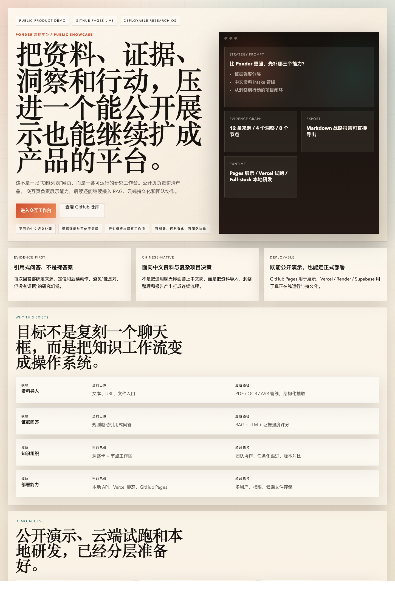

# Ponder 对标平台

一个面向知识工作流的可部署平台原型。目标不是复刻一个聊天产品，而是把 `资料导入 -> 引用式回答 -> 洞察整理 -> 节点组织 -> 报告导出` 压进同一个工作台，并逐步扩成真正可用的研究操作系统。

## 在线访问

- Public site: [GitHub Pages](https://mokangmedical.github.io/ponder-knowledge-platform/)
- Interactive deploy: [Vercel Production](https://ponder-knowledge-static.vercel.app)
- Source code: [GitHub Repository](https://github.com/MoKangMedical/ponder-knowledge-platform)

## 首页预览



## 这个项目在解决什么

大多数“AI 知识工具”只解决了问答，不解决研究过程本身。这个项目更关注下面几件事：

- 让文本、URL、文件进入统一来源库
- 让回答必须带引用和可追溯证据
- 让洞察不是停留在聊天记录里，而是能转成节点、卡片和报告
- 让公开展示、静态部署、全栈研发三种形态可以并存

## 当前已实现

- 文本、URL、文件三类资料导入入口
- 引用式问答与后续动作建议
- 来源库、洞察板、知识节点
- Markdown 报告导出
- 本地 JSON / 浏览器本地 / Supabase 三层存储回退
- GitHub Pages 公开展示
- Vercel 静态部署
- Render / Fastify 全栈运行骨架
- Vercel Blob 上传接入位

## 演示说明

当前公开演示站点默认不需要登录，也没有固定 Demo 账号。

- GitHub Pages: 公开展示页 + 可进入交互工作台，默认使用浏览器本地工作区
- Vercel: 可作为线上 Demo 入口，配置 Supabase 后可启用云端持久化
- Local full-stack: 用于研发、联调和继续补齐后端能力

## 项目结构

```text
apps/
  api/          Fastify API，负责 intake / ask / export，并在生产环境托管前端
  web/          Vite + React 前端，包含公开展示页与交互工作台
packages/
  shared/       共享类型、示例数据、领域逻辑
supabase/
  schema.sql    云端持久化表结构
```

## 本地启动

```bash
npm install
npm run dev
```

默认端口：

- Web: `http://localhost:3000`
- API: `http://localhost:4000`

## 生产构建

```bash
npm install
npm run build
npm start
```

## GitHub Pages 发布

```bash
npm run build:pages
```

- 发布目录：`apps/web/dist`
- Pages 地址：`https://mokangmedical.github.io/ponder-knowledge-platform/`
- 这一路径适合公开展示和对外访问，不依赖后端服务

## 云端持久化

前端支持 `API -> Supabase -> localStorage` 的三级回退。如果你要把静态站升级成真正的在线产品：

1. 在 Supabase 中执行 [schema.sql](supabase/schema.sql)
2. 配置：
   - `VITE_SUPABASE_URL`
   - `VITE_SUPABASE_ANON_KEY`
   - `VITE_SUPABASE_WORKSPACE_ID`
3. 重新部署前端

如果要启用文件云上传，还需要配置：

- `BLOB_READ_WRITE_TOKEN`

## 适合继续往前补的能力

1. `intake/file` 接入 PDF / OCR / ASR 解析链路
2. 用 PostgreSQL + pgvector 替代当前 demo 级存储
3. 用 LLM + retrieval 重写问答、洞察和行动建议
4. 增加登录、权限、团队协作和分享能力
5. 增加证据强度评分、版本对比、行业模板
